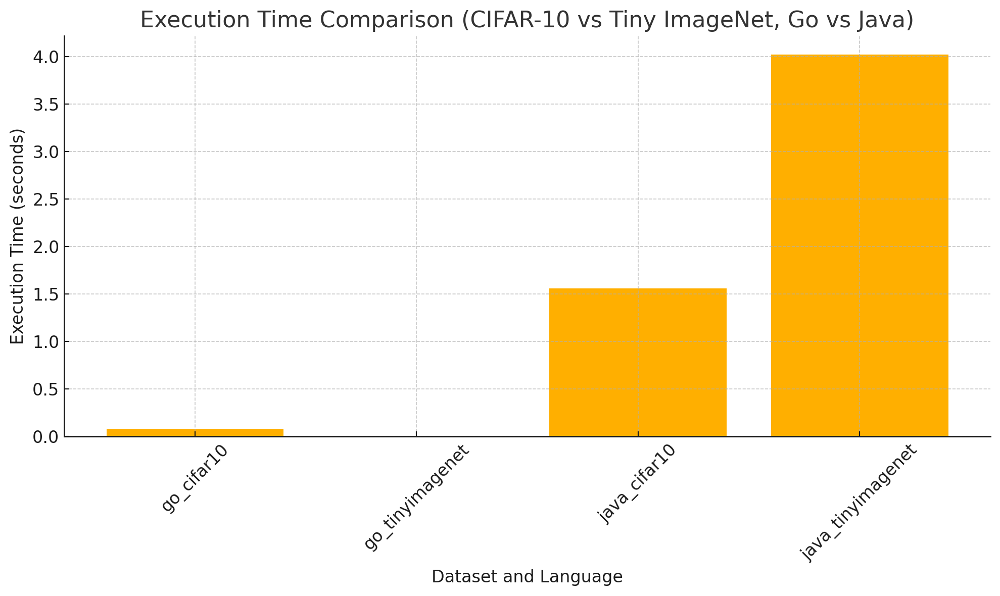
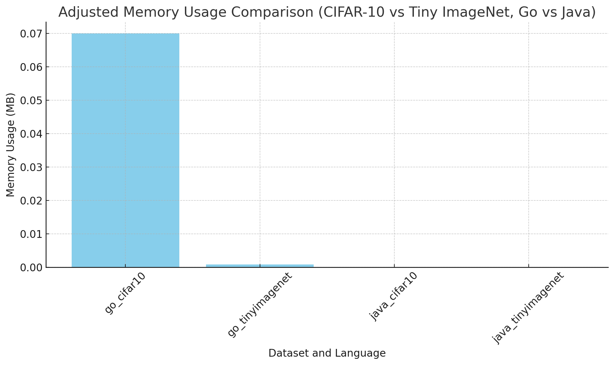
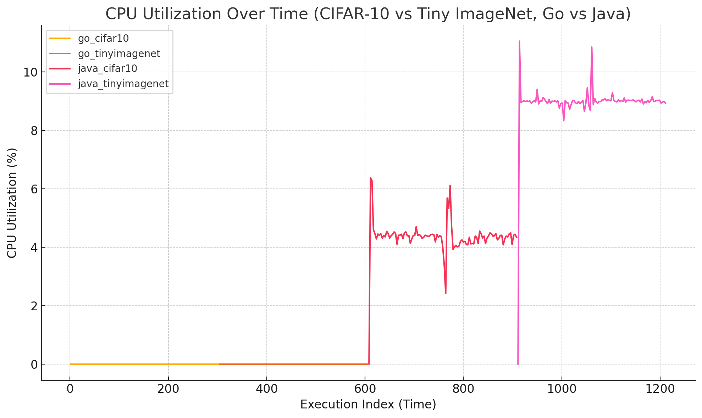

# Java-Go-Concurrency-Benchmarks

## Overview

This repository contains the implementation and benchmarking of concurrency models in **Java** and **Go**. The primary focus is to compare **Java's Producer-Consumer concurrency model** (using `BlockingQueue` and `ExecutorService`) and **Go's goroutines with channels** for image processing tasks. Benchmarks are conducted on two datasets: **CIFAR-10** and **Tiny ImageNet**, and the evaluation is based on four key metrics:

1.  **Execution Time**
2.  **Memory Usage**
3.  **CPU Utilization**
4.  **Concurrency Overhead**

The goal of this project is to understand how these concurrency models perform under real-world, high-computation tasks such as preprocessing image datasets for machine learning.

---

## Structure

The repository is organized into the following sections:

### 1. `java/`

Contains the Java implementation of the **Producer-Consumer concurrency model**. Key optimizations and metrics tracking have been integrated into the implementation:

-   **Core features**:

    -   Implements `BlockingQueue` to handle task queuing.
    -   Utilizes `ExecutorService` for managing a thread pool, with thread count optimized based on the system's CPU cores.
    -   **Preprocessing tasks**: Image transformation and dummy pixel manipulation (e.g., multiplying all pixel values by 2).
    -   Four key metrics (execution time, memory usage, CPU utilization, concurrency overhead) are calculated and logged during each run.
    
-   **Key Components**:

    -   `ImageProcessor.java`: Main class for preprocessing tasks with the Producer-Consumer model.
    -   **Optimizations**:
        -   Datasets are preloaded into memory before multiple processing runs, significantly reducing redundant IO overhead.
        -   Thread pool sizes dynamically adjusted based on CPU utilization and task wait/compute ratio.
        -   JVM tuning parameters (`-Xms` and `-Xmx` for heap size, `-XX:+UseG1GC` for garbage collection) are used to improve performance.
        
-   **Datasets Used**:

    -   CIFAR-10 binary files are directly loaded and preprocessed.
    -   Tiny ImageNet dataset is loaded as image files (`.jpg`/`.png`) and preprocessed.

---

### 2. `go/`

Contains the Go implementation of the **goroutine-based concurrency model**, leveraging channels for task management. Similar to the Java implementation, Go handles the same preprocessing tasks for benchmarking:

-   **Core features**:

    -   Uses goroutines to manage task parallelism.
    -   Channels are used for Producer-Consumer communication.
    -   Preloads datasets into memory to minimize redundant IO during multiple processing runs.
    -   Four metrics (execution time, memory usage, CPU utilization, concurrency overhead) are logged for every run.
    
-   **Key Components**:

    -   `tinyimagenet/main.go`: Loads the Tiny ImageNet dataset and processes batches concurrently using goroutines.
    -   `cifar-10/main.go`: Processes the CIFAR-10 dataset in binary format with concurrency.
    -   **Optimizations**:
        -   Minimal concurrency overhead due to lightweight goroutines and efficient channel communication.
        -   Preprocessing runs do not reload datasets from disk, enhancing overall performance.

---

### 3. `datasets/`

This folder contains the links and preprocessing scripts for the datasets used in the project:

-   [CIFAR-10 Dataset](https://www.cs.toronto.edu/~kriz/cifar.html): Preloaded as binary batches (`data_batch_1.bin`, etc.).
-   [Tiny ImageNet Dataset](https://www.kaggle.com/datasets/akash2sharma/tiny-imagenet): Preloaded as image files in `/train/` directory.

---

### 4. `benchmarks/`

Contains scripts and result files for benchmarking Java's and Go's concurrency models. Metrics are logged for both languages and can be visualized using external tools or scripts.

#### **Metrics Evaluated**

1.  **Execution Time**: Measures the time taken for all preprocessing tasks to complete.
    - 
    
2.  **Memory Usage**: Tracks memory allocation before and after task execution.
    - 
    
3.  **CPU Utilization**: Tracks CPU usage during task execution.
    - 

---

## Key Results

### CIFAR-10 Dataset

| Metric                  | Java (Producer-Consumer) | Go (Goroutines) |
|-------------------------|--------------------------|-----------------|
| **Average Execution Time** | ~1.09 seconds            | ~0.03 seconds    |
| **Average Memory Usage**   | ~0 MB                    | ~0.01 MB         |
| **Average CPU Utilization**| ~4.34%                  | ~0%             |
| **Concurrency Overhead**   | ~1.09 seconds            | ~0.03 seconds    |

### Tiny ImageNet Dataset

| Metric                  | Java (Producer-Consumer) | Go (Goroutines) |
|-------------------------|--------------------------|-----------------|
| **Average Execution Time** | ~1.04 seconds            | ~0.000000588 seconds |
| **Average Memory Usage**   | ~0 MB                    | ~0.000486679 MB |
| **Average CPU Utilization**| ~8.93%                  | ~0%             |
| **Concurrency Overhead**   | ~1.04 seconds            | ~0.000000806 seconds |

---

## How to Run

### Java

1.  Ensure you have Java 11+ and Maven installed.
2.  Compile the project:

    ```bash
    mvn clean install
    ```

3.  Run the Java implementation:

    ```bash
    java -Xms4G -Xmx8G -XX:+UseG1GC -jar target/ImageProcessor.jar
    ```

### Go

1.  Ensure you have Go 1.19+ installed.
2.  Run the Go implementation:

    ```bash
    go run main.go
    ```

---

## Improvements Made

### Java:

-   Preloaded datasets into memory for all runs to eliminate IO overhead.
-   Optimized thread pool size using `Runtime.getRuntime().availableProcessors()`.
-   Added JVM tuning parameters for better garbage collection and heap management.
-   Integrated metric tracking for memory usage, CPU utilization, and concurrency overhead.

### Go:

-   Optimized goroutines and channels for minimal overhead.
-   Integrated `gopsutil` for accurate memory and CPU profiling.
-   Preloaded datasets into memory to avoid redundant disk reads.

---

## Future Work

-   Extend benchmarking to include GPU-accelerated tasks for both Java (via DL4J) and Go (via CUDA bindings).
-   Add support for distributed systems benchmarking using frameworks like Apache Kafka (Java) and NATS (Go).
-   Explore newer Java concurrency features like `Virtual Threads` (introduced in Java 19).

---

## Contributors

-   **Deeptanshu Sankhwar**
-   **Jooseok Lee**
-   **Saivenu Kolli**
